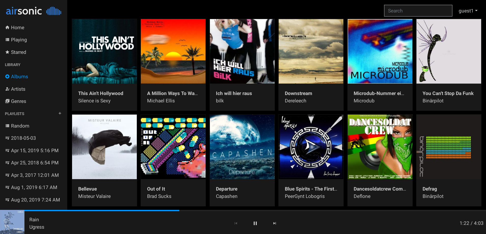

# Airsonic Web Client

[](https://github.com/tamland/airsonic-frontend/actions)

Modern responsive web frontend for [Airsonic](https://github.com/airsonic/airsonic). It's currently based on the [Subsonic API](http://www.subsonic.org/pages/api.jsp) and should work with other backends implementing this API as well.





## Supported features
- Responsive UI. Works on mobile and desktop
- Playback with presistent queue
- Browse library for albums, artist, generes and starred songs
- Create, delete and edit playlists
- Search for artists, albums and songs
- Play random songs with the built-in smart playlist


## Demo

https://airsonic.netlify.com

Password is `guest`.

You can use the URL and credentials for your own server if you prefer. **Note**: if your server is using http only you must allow mixed content in your browser otherwise login will not work.


## Build

```
yarn install
yarn build
```

Bundle can be found in the `dist` folder.


## Develop

```
yarn install
yarn serve
```


## License

Licensed under the [AGPLv3](LICENSE) license.
