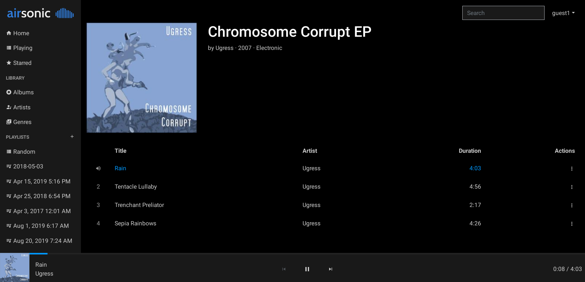
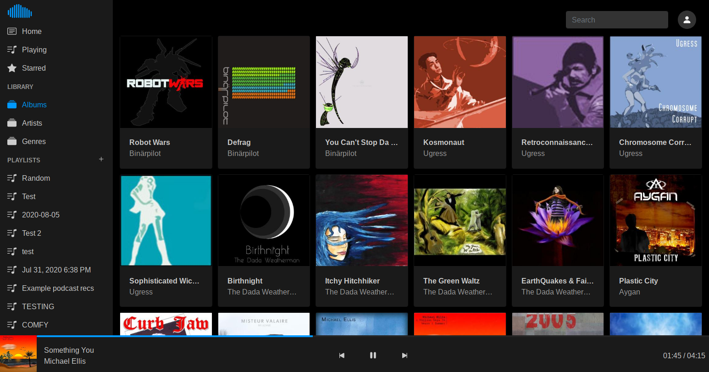

# Airsonic Web Client

[](https://github.com/tamland/airsonic-frontend/actions)
[](https://hub.docker.com/r/tamland/airsonic-frontend)

Modern responsive web frontend for [Airsonic](https://github.com/airsonic-advanced/airsonic-advanced) and other [Subsonic](https://github.com/topics/subsonic) based music servers.

## Features
- Responsive UI for desktop and mobile
- Browse library for albums, artist, generes
- Playback with persistent queue, repeat & shuffle
- MediaSession integration
- View, create, and edit playlists with drag and drop
- Built-in 'random' playlist
- Search
- Favourites
- Internet radio
- Podcasts

## [Live demo](https://airsonic.netlify.com)

Enter the following details:  
Server: `/api`  
Username: `guest4`, `guest5`, `guest6` etc.  
Password:`guest`

You can try the demo with your own local server as well. Simply enter the full URL of your Airsonic server in the Server field (such as http://localhost:8080) with your credentials.  **Note**: if your server is using http only you must allow mixed content in your browser otherwise login will not work.

## Screenshots






## Install

### Docker

```
$ docker run -d -p 8080:80 tamland/airsonic-frontend:latest
```

You can now access the application at http://localhost:8080/

Environment variables:
- `SERVER_URL` (Optional): The backend server URL. When set the server input on the login page will not be displayed.


### Pre-built bundle

Pre-built bundles can be found in the [Actions](https://github.com/tamland/airsonic-frontend/actions)
tab. Download/extract artifact and serve with any web server such as nginx or apache.

### Build from source

```
$ yarn install
$ yarn build
```

Bundle can be found in the `dist` folder.

Build docker image:

```
$ docker build -f docker/Dockerfile .
```

## Develop

```
$ yarn install
$ yarn serve
```


## License

Licensed under the [AGPLv3](LICENSE) license.
